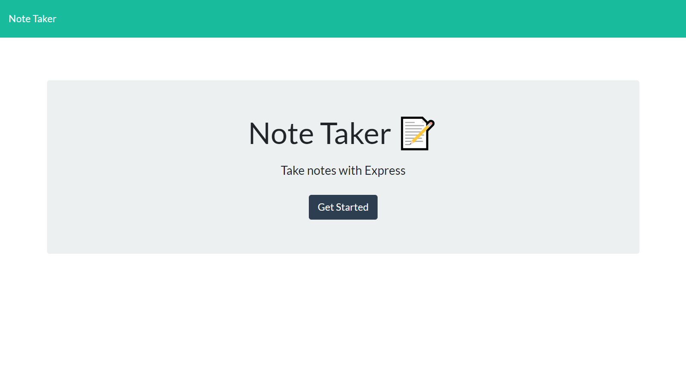
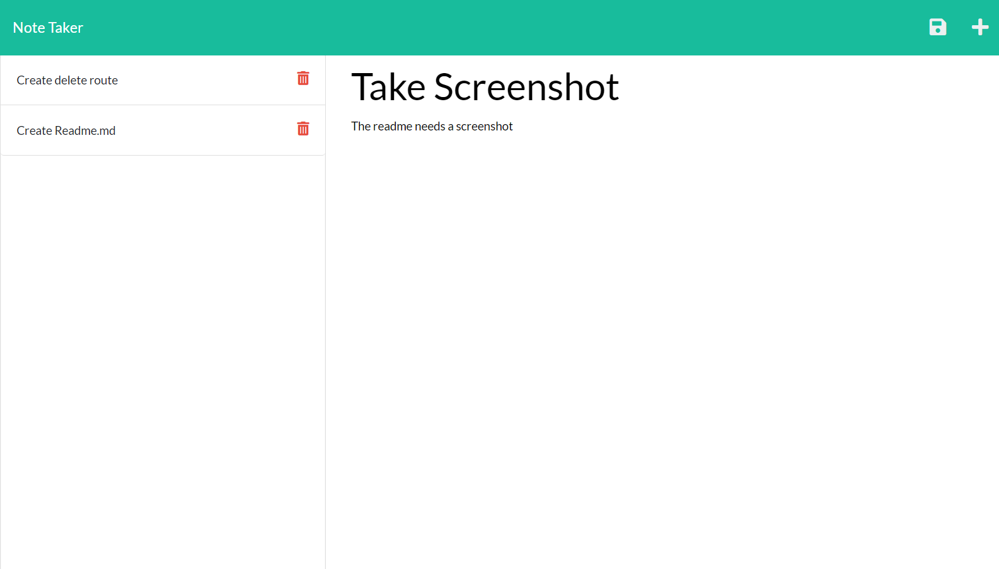

# Note Taker
  
  
  
  

  ## Description

  This application allows the user to save and review notes for future reference. It is a quick way to write something down and can be used with any internet connection.

  
  

  ## Usage

  1. Navigate to the [homepage](https://evening-harbor-23999.herokuapp.com/) to use this application.
  2. Click "Get Started"
  
  To create a new note:
  
  1. Click on "Note Title" and type in a title for your note
  2. Click on "Note text" and type in the text
  3. Click the save file icon that appears to save your note

  To review a note click on the note you would like to review on the left hand side of the page. 

  ## Credits

  * created by: Dave Halladay
  * collaborators: Xandromus

    ## Questions

  Reach out with any questions:

  * [github](https://github.com/dhalladay)

  ## Future development

  A delete function will soon be added so that tasks or notes that are no longer needed can be removed. 

  ## License

  Copyright &copy; Dave Halladay.

  
  Licensed under the [MIT](
  https://opensource.org/licenses/MIT
  ) license.
  